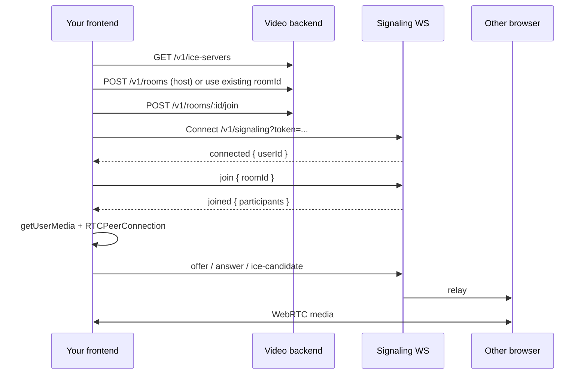

# Frontend Integration Guide

> How to connect **any frontend** (React, Vue, Angular, plain HTML, mobile WebView) to the Video SDK backend.
>
> **Last updated:** 2026-06-12 · **API version:** `v1` · **Signaling version:** `1`

---

## Feature index

Use this table to jump to a section. **When you add a backend or SDK feature, add a row here and a matching section below.**

| Feature | Status | Section |
|---------|--------|---------|
| JWT authentication | ✅ | [Authentication](#authentication) |
| Session cookie auth | ✅ (adapter stub) | [Authentication](#authentication) |
| ICE / STUN servers | ✅ | [Fetch ICE servers](#1-fetch-ice-servers) |
| TURN credentials | ✅ | [Fetch ICE servers](#1-fetch-ice-servers) |
| Create / join room | ✅ | [Room lifecycle](#2-room-lifecycle) |
| WebSocket signaling | ✅ | [Signaling WebSocket](#3-signaling-websocket) |
| 1:1 video call (WebRTC) | ✅ | [WebRTC negotiation](#4-webrtc-negotiation) |
| Browser SDK (`VideoClient`) | ✅ | [Option A — Browser SDK](#option-a--browser-sdk-recommended) |
| Mute mic / remote audio | ✅ | [SDK controls](#sdk-controls) |
| Share link (host → guest) | ✅ | [Host and guest flow](#host-and-guest-flow) |
| Staff call invite / accept | ✅ | [Staff calling](#staff-calling-simfree-admin) |
| SFU group meetings (up to 6) | ✅ | [Group meetings (SFU)](#group-meetings-sfu) |
| Meeting links + guest join | ✅ | [Group meetings (SFU)](#group-meetings-sfu) |
| Screen share (meetings) | ✅ | [Group meetings (SFU)](#group-meetings-sfu) |
| Meeting lobby (host admit) | ✅ | [Group meetings (SFU)](#group-meetings-sfu) |
| In-meeting chat + emoji | ✅ | [Group meetings (SFU)](#group-meetings-sfu) |
| Virtual backgrounds (client) | ✅ | [Virtual backgrounds](#virtual-backgrounds) |
| Dev token endpoint | ✅ (dev only) | [Development helpers](#development-helpers) |
| Recording | ❌ | — |

---

## What the backend does (and does not do)

| Backend handles | Frontend / browser handles |
|-----------------|--------------------------|
| Auth validation | User login UI |
| Room create/join (HTTP) | UI to start or join a call |
| ICE server list (STUN + TURN creds) | `RTCPeerConnection` setup |
| Signaling relay (SDP + ICE over WebSocket) | Camera/mic via `getUserMedia` |
| Short-lived TURN credentials | Rendering `<video>` elements |

**Media never flows through the API.** After signaling, audio/video goes **peer-to-peer** or through **TURN** when P2P fails.

---

## Architecture overview

```
Your frontend app
  │
  ├─ HTTP  →  Auth, rooms, ICE servers
  │
  ├─ WebSocket  →  join, offer, answer, ice-candidate (signaling only)
  │
  └─ WebRTC  →  camera/mic + encrypted media (P2P or TURN)
```



---

## Prerequisites

| Requirement | Details |
|-------------|---------|
| **HTTPS** | Required for camera/mic on LAN IPs. `localhost` over HTTP is OK. |
| **Secure context** | WebRTC + `getUserMedia` need a secure context in production. |
| **CORS** | Backend allows cross-origin requests (`origin: true`). Frontend can run on a different port/domain than the API. See [`docs/deployment-split-servers.md`](deployment-split-servers.md). |
| **Two distinct users** | 1:1 calls need **two different JWTs** (different `userId` claims). |
| **POST body** | Room endpoints expect `Content-Type: application/json` with body `{}`. |

Default dev URLs (adjust to your setup):

| Service | URL |
|---------|-----|
| API | `http://127.0.0.1:3004` or `https://<LAN_IP>:3004` |
| Demo static server | `npm run demo:https` → `https://<LAN_IP>:5000` |

---

## Authentication

All protected endpoints require auth. The backend supports pluggable adapters (`AUTH_MODE=jwt` by default).

### JWT (production pattern)

Your **own auth service** issues a JWT. The video backend validates it with `JWT_SECRET` (must match your issuer or use the same secret).

```http
Authorization: Bearer <jwt>
```

The JWT payload must include a stable user id (see `src/auth/jwt-auth.adapter.ts` for the expected claim).

### Session cookie (optional)

Set `AUTH_MODE=session` and configure `AUTH_SERVICE_URL`. The frontend sends the session cookie; WebSocket can use `?sessionId=` instead of `?token=`.

### Development helpers

**Only available when `NODE_ENV=development`:**

```http
GET /v1/dev/token?userId=alice
```

Response:

```json
{
  "token": "eyJ...",
  "userId": "alice"
}
```

CLI equivalent: `pnpm token alice`

---

## Integration paths

### Option A — Browser SDK (recommended)

Fastest path for web apps. The SDK wraps HTTP, WebSocket, WebRTC, and basic controls.

#### Install / build

The SDK lives in this repo at `packages/client-sdk`. Build it:

```bash
pnpm build:sdk
```

#### Sync to Simfree admin (`@simfree/video-client`)

The Simfree monorepo keeps a copy at `packages/video-client` (`@simfree/video-client`). After changing SDK sources here, sync them:

```bash
npm run sync:simfree
# or: SIMFREE_ROOT=/path/to/simfree-monorepo bash scripts/sync-sdk-to-simfree.sh
```

This copies `packages/client-sdk/src/*.ts` only — **not** `package.json` (Simfree keeps its package name and `prepare` script). Then rebuild in simfree-monorepo:

```bash
cd ../simfree-monorepo
pnpm --filter @simfree/video-client build
pnpm --filter admin build
```

Import from your app:

```javascript
import { VideoClient } from "@video-sdk/client";
// or, during local dev from repo root:
// import { VideoClient } from "/packages/client-sdk/dist/index.js";
```

#### Minimal example

```javascript
import { VideoClient } from "@video-sdk/client";

const localVideo = document.querySelector("#localVideo");
const remoteVideo = document.querySelector("#remoteVideo");

const client = await VideoClient.connect({
  serverUrl: "https://192.168.1.142:3004",
  token: userJwt,
  roomId: undefined, // omit to create a new room; set string to join existing
  localVideo,
  remoteVideo,
});

console.log(`Joined as ${client.userId} in room ${client.roomId}`);

client.on((event) => {
  switch (event.type) {
    case "connected":
    case "room-ready":
    case "peer-joined":
    case "peer-left":
    case "error":
      console.log(event);
      break;
    case "remote-stream":
      // stream also attached to remoteVideo if you passed the element
      break;
  }
});

// End call
client.hangup();
```

Working reference: `examples/demo/app.js` + `examples/demo/index.html`.

#### SDK controls

| Method | Description |
|--------|-------------|
| `VideoClient.connect(options)` | ICE fetch → room create/join → media → signaling |
| `client.on(handler)` / `client.off(handler)` | Subscribe to events |
| `client.userId` | Authenticated user id |
| `client.roomId` | Active room id |
| `client.getLocalStream()` | Local `MediaStream` |
| `client.setMicMuted(muted)` | Enable/disable local mic track |
| `client.isMicMuted()` | Current mic mute state |
| `client.setRemoteAudioMuted(muted)` | Mute remote audio in `<video>` element |
| `client.isRemoteAudioMuted()` | Remote mute state |
| `client.hangup()` / `client.leave()` | Stop tracks, close peers and WebSocket |

#### SDK events

| Event | When |
|-------|------|
| `connected` | WebSocket authenticated; includes `userId` |
| `room-ready` | Joined room via signaling; includes `participants` |
| `peer-joined` | Another user entered the room |
| `remote-stream` | Remote media available (`userId`, `stream`) |
| `peer-left` | Peer connection failed or closed |
| `error` | Signaling or client error message |

#### Connect options

```typescript
interface VideoClientConnectOptions {
  serverUrl: string;   // e.g. "https://api.example.com:3004"
  token: string;         // JWT (with or without "Bearer " prefix)
  roomId?: string;       // omit = create new room
  localVideo?: HTMLVideoElement;
  remoteVideo?: HTMLVideoElement;
}
```

---

### Option B — Manual integration (any stack)

Use this for full control, non-browser platforms, or custom UI frameworks.

Follow these steps **in order**.

#### 1. Fetch ICE servers

```http
GET /v1/ice-servers
Authorization: Bearer <token>
```

Response:

```json
{
  "iceServers": [
    { "urls": "stun:stun.l.google.com:19302" },
    {
      "urls": "turn:3.73.242.203:3478",
      "username": "1700000000:alice",
      "credential": "..."
    }
  ]
}
```

Use the array as `iceServers` in `new RTCPeerConnection({ iceServers })`.

TURN entries appear only when the server has `TURN_URL` / `TURN_SECRET` configured.

#### 2. Room lifecycle

**Host — create a room:**

```http
POST /v1/rooms
Authorization: Bearer <token>
Content-Type: application/json

{}
```

Response:

```json
{
  "roomId": "550e8400-e29b-41d4-a716-446655440000",
  "createdAt": "2026-06-09T12:00:00.000Z"
}
```

**Both parties — join before signaling:**

```http
POST /v1/rooms/{roomId}/join
Authorization: Bearer <token>
Content-Type: application/json

{}
```

Response:

```json
{
  "roomId": "550e8400-e29b-41d4-a716-446655440000",
  "participants": ["alice"],
  "alreadyJoined": false
}
```

Errors:

| Status | Code | Meaning |
|--------|------|---------|
| 404 | `room_not_found` | Invalid `roomId` |
| 401 | — | Missing or invalid auth |

> **Important:** HTTP join is required before WebSocket `join`. Signaling returns `not_in_room` otherwise.

#### 3. Signaling WebSocket

**URL:**

```
ws://<host>:<port>/v1/signaling?token=<jwt>
```

Use `wss://` when the API runs over HTTPS.

Alternative for session auth: `?sessionId=<id>`

**First message from server:**

```json
{ "type": "connected", "userId": "alice", "v": 1 }
```

**Client sends join:**

```json
{ "type": "join", "roomId": "550e8400-e29b-41d4-a716-446655440000" }
```

**Server responds:**

```json
{
  "type": "joined",
  "roomId": "550e8400-e29b-41d4-a716-446655440000",
  "participants": ["bob"],
  "v": 1
}
```

`participants` lists **other** users already in the room (not including you).

When someone else joins later, existing peers receive:

```json
{ "type": "peer-joined", "userId": "carol", "v": 1 }
```

#### 4. WebRTC negotiation

After `joined`:

1. Call `navigator.mediaDevices.getUserMedia({ audio: true, video: true })`.
2. For each peer id in `participants`, create `RTCPeerConnection({ iceServers })`.
3. Add local tracks with `pc.addTrack(track, stream)`.
4. **Offerer** (you received their id in `participants`): create offer, set local description, send:

```json
{ "type": "offer", "to": "bob", "sdp": "v=0\r\n..." }
```

5. **Answerer** (on incoming offer):

```json
{ "type": "answer", "to": "alice", "sdp": "v=0\r\n..." }
```

6. **Both** — on `onicecandidate`, send:

```json
{
  "type": "ice-candidate",
  "to": "bob",
  "candidate": {
    "candidate": "candidate:...",
    "sdpMid": "0",
    "sdpMLineIndex": 0
  }
}
```

7. Attach remote stream on `pc.ontrack` → `<video srcObject>`.

**Server → client relay messages:**

| type | Fields | Meaning |
|------|--------|---------|
| `offer` | `from`, `sdp` | Incoming SDP offer |
| `answer` | `from`, `sdp` | Incoming SDP answer |
| `ice-candidate` | `from`, `candidate` | Incoming ICE candidate |
| `error` | `code`, `message` | e.g. `not_in_room` |

Signaling is a **blind relay** — the server does not parse SDP; it routes by `userId` within the room.

---

## Host and guest flow

Typical product UX:

| Step | Host | Guest |
|------|------|-------|
| 1 | User logs in → JWT | User logs in → JWT |
| 2 | `POST /v1/rooms` → get `roomId` | Opens link with `roomId` |
| 3 | Share link / room code | `POST /v1/rooms/:id/join` |
| 4 | `VideoClient.connect({ roomId })` or manual WS + WebRTC | Same with shared `roomId` |
| 5 | Both see/hear each other | |
| 6 | Hang up → `client.leave()` | |

**Share link pattern** (from demo):

```
https://your-app.com/call?room=<roomId>&server=https://192.168.1.142:3004
```

Parse query params in your router; pass `roomId` and `serverUrl` into `VideoClient.connect`.

---

## Framework notes

| Stack | Guidance |
|-------|----------|
| **React / Next.js** | Use a client component only (`"use client"`). Connect in `useEffect`; call `client.leave()` in cleanup. |
| **Vue** | Connect in `onMounted`; cleanup in `onUnmounted`. |
| **Angular** | Use `ngAfterViewInit` for video element refs; destroy on `ngOnDestroy`. |
| **SSR** | Do not run WebRTC on the server. Gate behind `typeof window !== "undefined"`. |
| **Mobile WebView** | Same HTTP + WS + WebRTC; ensure HTTPS and OS media permissions. |
| **Native mobile** | No official native SDK yet — implement REST + WS protocol with platform WebRTC. |

### React sketch

```tsx
"use client";

import { useEffect, useRef } from "react";
import { VideoClient } from "@video-sdk/client";

export function CallRoom({ token, roomId }: { token: string; roomId?: string }) {
  const localRef = useRef<HTMLVideoElement>(null);
  const remoteRef = useRef<HTMLVideoElement>(null);

  useEffect(() => {
    let client: VideoClient | null = null;
    let cancelled = false;

    VideoClient.connect({
      serverUrl: process.env.NEXT_PUBLIC_VIDEO_API!,
      token,
      roomId,
      localVideo: localRef.current ?? undefined,
      remoteVideo: remoteRef.current ?? undefined,
    }).then((c) => {
      if (cancelled) {
        c.leave();
        return;
      }
      client = c;
    });

    return () => {
      cancelled = true;
      client?.leave();
    };
  }, [token, roomId]);

  return (
    <div>
      <video ref={localRef} autoPlay muted playsInline />
      <video ref={remoteRef} autoPlay playsInline />
    </div>
  );
}
```

---

## REST API reference

| Method | Path | Auth | Description |
|--------|------|------|-------------|
| GET | `/health` | No | Health check |
| GET | `/v1/dev/token?userId=` | No | Dev JWT (development only) |
| GET | `/v1/me` | Yes | Current authenticated user |
| GET | `/v1/ice-servers` | Yes | STUN + TURN config for WebRTC |
| POST | `/v1/rooms` | Yes | Create room |
| POST | `/v1/rooms/:roomId/join` | Yes | Join room (required before WS) |

WebSocket:

| Path | Auth |
|------|------|
| `/v1/signaling?token=` | JWT query param |
| `/v1/signaling?sessionId=` | Session mode |

---

## Troubleshooting

| Symptom | Likely cause | Fix |
|---------|--------------|-----|
| 401 on `/v1/ice-servers` | Missing/expired JWT | Refresh token; check `Authorization` header |
| 400 on room join | Empty POST body | Send `{}` with `Content-Type: application/json` |
| `not_in_room` on WS | Skipped HTTP join | Call `POST /v1/rooms/:id/join` first |
| Camera blocked on LAN | HTTP page | Serve frontend over HTTPS (`npm run demo:https`) |
| `fetch` / Invalid URL | Bad server URL | Use full origin: `https://192.168.1.142:3004` |
| One-way video | ICE/TURN failure | Configure TURN; see `docs/coturn-vps.md` |
| Same user twice | Same JWT | Use two different `userId` tokens for testing |

---

## Local dev quick test

```bash
# Terminal 1 — API
pnpm dev:lan:https

# Terminal 2 — demo frontend
npm run demo:https

# Terminal 3 — tokens
pnpm token user-a
pnpm token user-b
```

1. Open demo in two browser tabs (or two devices on same Wi‑Fi).
2. Tab A: Get token `user-a` → Connect (creates room).
3. Copy share link → Tab B: Get token `user-b` → Connect.

---

## Related docs

| Doc | Topic |
|-----|--------|
| `docs/codebase-exploration.md` | Learn the repo — file map, reading order, call trace |
| `docs/deployment-split-servers.md` | App on one host, video API on another |
| `docs/coturn-vps.md` | TURN server setup on VPS |
| `PLAN.md` | Backend build plan and phase tracker |
| `examples/demo/` | Reference frontend implementation |

---

## Group meetings (SFU)

**Added:** 2026-06-10 · **Status:** ✅

### Why

1:1 staff calls stay **P2P mesh**. Group meetings use an embedded **mediasoup SFU** so each participant sends one upstream and receives N downstream streams (up to **6 peers** on a small VPS).

### Create a meeting (staff JWT)

```http
POST /v1/meetings
Authorization: Bearer <staff-jwt>
Content-Type: application/json

{ "title": "Team standup" }
```

Response:

```json
{
  "roomId": "uuid",
  "code": "AB12CD34",
  "joinUrl": "https://admin.simfree.io/meet/AB12CD34",
  "maxParticipants": 6
}
```

Set `MEETING_BASE_URL` on the server so `joinUrl` matches your frontend.

### Guest join (no account)

```http
POST /v1/meetings/:code/guest-token
Content-Type: application/json

{ "name": "Alex Guest" }
```

Returns `{ token, userId, roomId, code, expiresIn }`. Guest JWT includes `role: "guest"` and `roomId` — they can only join that room.

Then:

```http
POST /v1/meetings/:code/guest-join
Authorization: Bearer <guest-token>
```

Join response includes `status`: `"admitted"` (meeting creator / already admitted) or `"waiting"` (guest or non-creator staff). `participants` is a roster array: `{ userId, displayName }[]`.

### Host lobby (WebSocket)

| Client → server | Who | Purpose |
|-----------------|-----|---------|
| `join` | everyone | After HTTP join; waiting users get `lobby.waiting` |
| `lobby.admit` | host only | Move user from waiting → admitted + SFU |
| `lobby.deny` | host only | Remove user from waiting room |
| `lobby.list` | host only | List pending users |

| Server → client | When |
|-----------------|------|
| `lobby.waiting` | User is in waiting room |
| `lobby.request` | Host notified of new waiter |
| `lobby.admitted` | User may start camera + SFU |
| `lobby.denied` | Host declined join |

Host = meeting creator (`createdBy` from `POST /v1/meetings`).

```http
GET /v1/meetings/:code/roster
Authorization: Bearer <host-jwt>
```

Returns `{ admitted, waiting }` roster arrays.

### In-meeting chat (WebSocket)

| Message | Purpose |
|---------|---------|
| `meeting.chat.send` `{ roomId, text }` | Send chat (admitted only, max 500 chars) |
| `meeting.chat` | Broadcast to all admitted participants |

### SDK — `MeetingClient`

```javascript
import { MeetingClient } from "@video-sdk/client";

// Staff (already has video JWT from your auth API)
const client = await MeetingClient.join({
  serverUrl: "https://admin.simfree.io/video-api",
  token: staffJwt,
  code: "AB12CD34",
});

client.on((event) => {
  if (event.type === "lobby-waiting") {
    // Show waiting UI — no media yet
  }
  if (event.type === "lobby-request") {
    // Host: event.userId, event.displayName — call client.admitParticipant()
  }
  if (event.type === "track-added") {
    // event.peerId, event.kind, event.source ("camera" | "screen"), event.stream
  }
  if (event.type === "chat-message") {
    // event.displayName, event.text
  }
});

client.admitParticipant(userId);
client.denyParticipant(userId);
client.sendChat("Hello 👋");

await client.startScreenShare();
await client.stopScreenShare();
await client.leave();
```

Signaling uses `sfu.*` messages over the same WebSocket (`sfu.getRtpCapabilities`, `sfu.createTransport`, `sfu.produce`, `sfu.consume`, …). Media RTP goes **directly to the VPS** on `MEDIASOUP_PORT` (default **40000** UDP/TCP), not through nginx/Cloudflare.

### Env vars (server)

| Variable | Description |
|----------|-------------|
| `MEDIASOUP_ANNOUNCED_IP` | VPS public IP (required in production) |
| `MEDIASOUP_PORT` | WebRTC listen port (default 40000) |
| `SFU_MAX_PEERS` | Max participants per meeting (default 6) |
| `MEETING_BASE_URL` | Prefix for `joinUrl` in create response |
| `GUEST_JWT_TTL_SECONDS` | Guest token lifetime |

---

## Virtual backgrounds

**Added:** 2026-06-10 · **Status:** ✅ (client-only)

### Why

Replace or blur the camera background before sending video to the SFU. The server never sees segmentation — only the processed video track.

### Simfree admin

See `apps/admin/src/lib/virtual-background.ts` and `MeetingRoom` controls. Uses `@mediapipe/tasks-vision` selfie segmentation + canvas compositing, then `MeetingClient.setVideoSource(processedTrack)`.

Modes: **none**, **blur**, **bundled gradient images**, or custom image URL.

---

## Maintaining this guide (for contributors)

**When you add a new backend or SDK feature that frontends must use, update this file in the same PR.**

### Checklist

1. Add a row to the [Feature index](#feature-index) table (✅ or ❌).
2. Add or extend a section with:
   - **Why** the frontend needs it
   - **HTTP/WS/SDK API** (method, path, payload, response)
   - **Minimal code example**
   - **Errors / edge cases**
3. Update [REST API reference](#rest-api-reference) or [SDK controls](#sdk-controls) if applicable.
4. Update **Last updated** date at the top.
5. If the feature replaces an old flow, mark the old section deprecated briefly, then remove after one release.

### Section template for new features

```markdown
## Feature name

**Added:** YYYY-MM-DD · **Status:** ✅

### Why

One sentence on what problem this solves for frontend devs.

### API / SDK

\`\`\`http
METHOD /v1/...
\`\`\`

### Frontend example

\`\`\`javascript
// minimal usage
\`\`\`

### Notes

- Edge cases, auth requirements, breaking changes.
```

### Cursor rule

Project rule `.cursor/rules/video-sdk-project.mdc` requires updating this guide whenever a user-facing feature ships.
